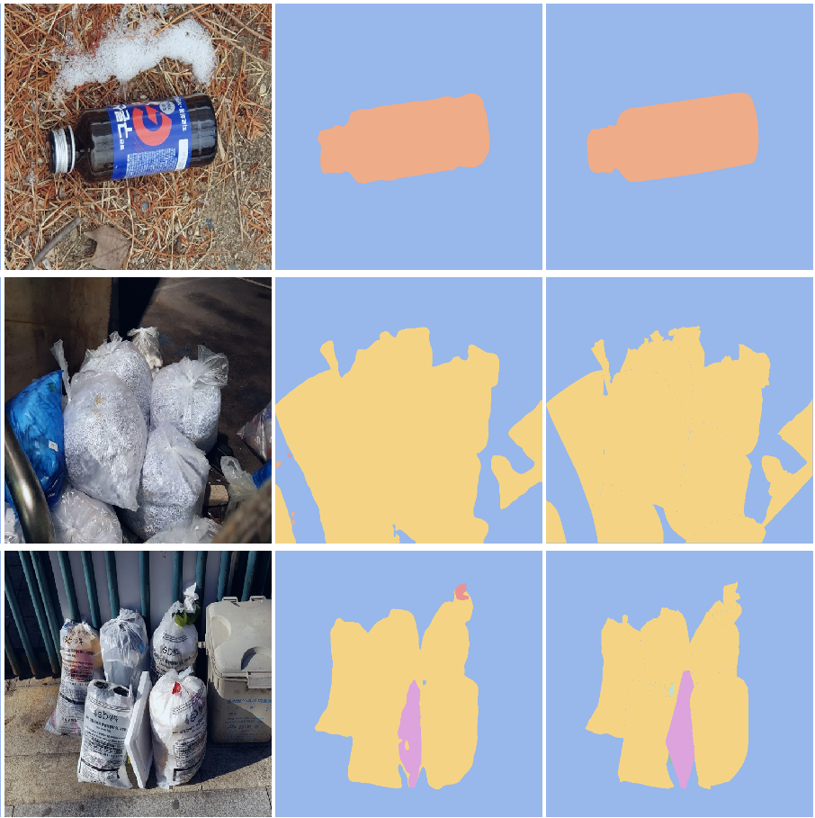

# semantic-segmentation-level2-cv-13
## 팀원
서동진 오주영 이유진 장동주 차미경 최한준
# 프로젝트 개요

 재활용 쓰레기의 분리배출을 통해 각종 쓰레기 처리 문제를 줄이고 환경 부담을 줄일 수 있습니다. 재활용 쓰레기의 정확한 분리배출을 돕거나 어린이의 분리배출 교육 등 여러방면에서 사용될 수 있는 Semantic Segmentation 모델을 만들었습니다.
(이전 object detection 프로젝트와 동일한 데이터를 이용하여 semantic segmentation을 수행하였습니다.)


# 디렉토리 구조


- EDA : 데이터 및 모델 출력 결과에 대한 EDA 도구를 모아둔 폴더
- dpt : Depth Prediction Transformer 모델을 위한 폴더
- fpn : Feature Pyramid Network 모델을 위한 폴더
- hrnet : HRnet 및 HRnet-ocr 모델을 위한 폴더
- unet_custom : Unet 모델(CBAM, fpn 모듈 추가)을 위한 폴더
- split_utils : train_all.json으로부터 train, validation set을 나누는 도구를 모아둔 폴더


# 실행 환경

- Python 3.9.7
- `pip install -r requirements.txt`

```
albumentations==1.1.0
matplotlib==3.4.3
numpy==1.21.2
pandas==1.3.4
Pillow==8.4.0
pycocotools==2.0.2
scikit-learn==1.0
seaborn==0.11.2
torch==1.9.1
torchvision==0.10.1
wandb==0.12.5
segmentation-models-pytorch @ git+https://github.com/qubvel/segmentation_models.pytorch@35d79c1aa5fb26ba0b2c1ec67084c66d43687220
ttach==0.0.3
```

# 주요 명령어

json 형태의 config 파일을 이용하여 모델 학습 및 추론을 원하는 조건으로 실행시킬 수 있습니다.

- 모델 train

```
  python train.py [train config 파일 경로 {(ex) ./train_config.json}]
```

- 모델 inference
 
```
  python inference.py [inference config 파일 경로 {(ex) ./inference_config.json}]
```

- 모델 ensemble

```
  python ensemble_inference.py [ensemble config 파일 경로{(ex) ./ensemble_inference_config.json}]
```

# 사용 가능한 모델
|model|Val mIoU| LB mIoU |
|---|---|---|
|U-Net++|0.680|0.707|
|Semantic FPN|0.657|0.703|
|Unet + CBAM + ASPP|0.685|0.705|
|FCN resnet-50|0.5736|0.579|
|DeepLabV3+|0.660|0.680|
# Example


# 참고자료
### Semantic FPN
- https://arxiv.org/pdf/1901.02446.pdf
- https://arxiv.org/pdf/1803.01534.pdf

### Deformable DeepLabV3
- https://arxiv.org/pdf/1706.05587.pdf
- https://arxiv.org/pdf/1703.06211.pdf

### DeepLabV3+
- https://arxiv.org/pdf/1802.02611.pdf

### FCM
- https://www.cv-foundation.org/openaccess/content_cvpr_2015/papers/Long_Fully_Convolutional_Networks_2015_CVPR_paper.pdf

